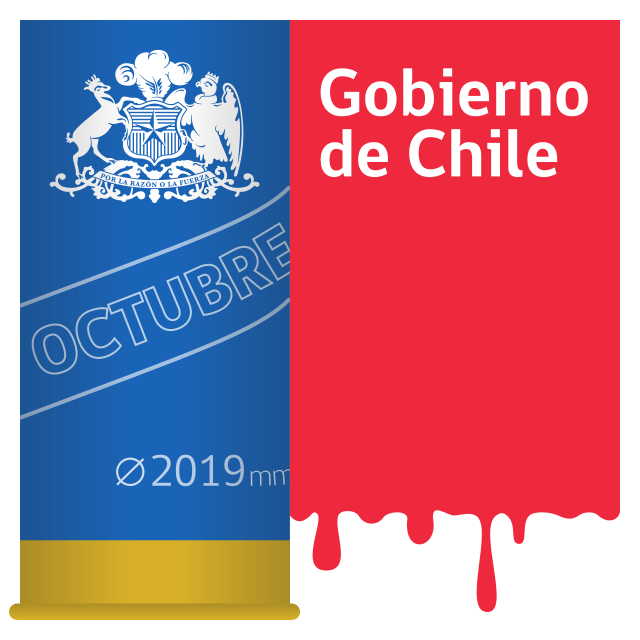

<h1 align='center'>Gobierno de Chile</h1>

A critical take on the logo of the chilean government, following the unproportional use of force against protesters in&nbsp;October&nbsp;2019, the&nbsp;instauration of a&nbsp;curfew in numerous&nbsp;cities across&nbsp;the&nbsp;country and&nbsp;the lethal&nbsp;deployment of the&nbsp;army in&nbsp;the&nbsp;streets.

  

  

## Credits

This image is based on the [official logo of the chilean government][official] which is licensed under a [CC-BY-3.0 CL][cc] license.

_By giving credit where credit is due I do not pretend that any of them endorse or approve this modified design in any way._ 🤷

  [cc]: https://creativecommons.org/licenses/by/3.0/cl/deed.en
  [official]: https://commons.wikimedia.org/wiki/File:Logo_Gobierno_de_Chile_2010-2014.svg

## License

Copyright © 2019 Gonzalo Bulnes Guilpain
 
Copyright © 2010 [Gobierno de Chile](https://www.gob.cl)

This work is licensed under a [Creative Commons Attribution 3.0 Unported License](https://creativecommons.org/licenses/by/3.0/).
